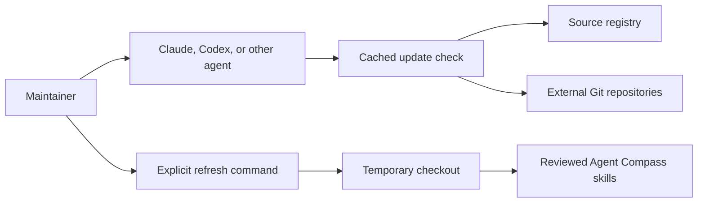
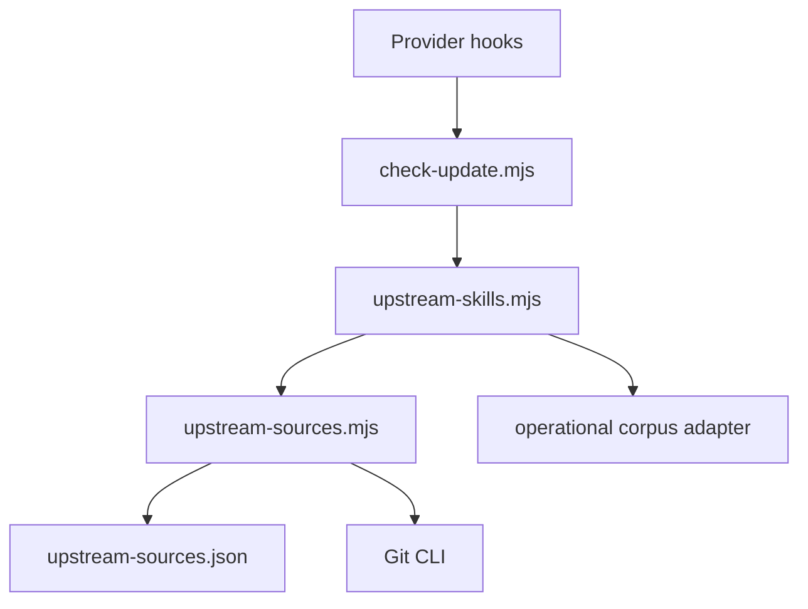
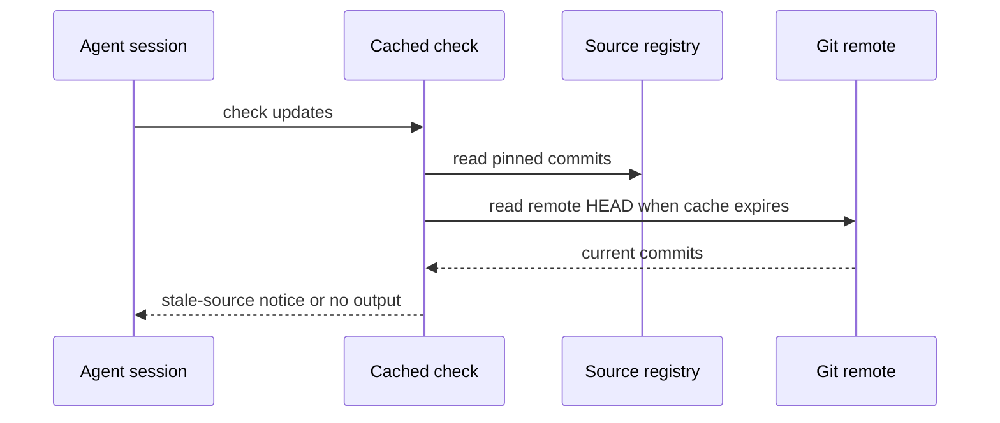
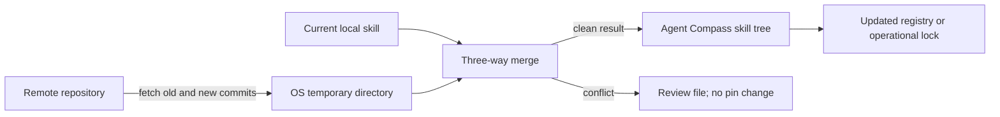

# ADR 001: Track External Skills In One Source Registry

Status: Accepted — partially superseded by
[ADR 002](002-tracked-external-reference-sources.md), which replaced vendoring
and `skills/upstream-lock.json` with tracked sources and install-time
adaptation. The registry, the cached read-only check, and the explicit-refresh
model decided here all remain in force.
Date: 2026-08-19

## Recommendation

Use one pinned source registry with cached Git checks and explicit refresh.
This choice keeps updates visible without executing or merging remote content.

## Context

- **Known:** Agent Compass contains skills from six external Git repositories.
- **Known:** The operational corpus already has a deterministic lock and local
  refresh transformation.
- **Known:** Firecrawl anydoc ships an Agent Skill and uses the MIT License.
  Research checked the [official repository](https://github.com/firecrawl/anydoc)
  on 2026-08-19.
- **Known:** Claude and Codex support project session-start hooks in the current
  Agent Compass templates.
- **Assumed:** Git is available because Agent Compass already requires it for
  source control and the existing vendoring workflow.
- **Unknown:** Some future provider can omit project hooks. `AGENTS.md` is the
  fallback for that provider.

## Significant Requirements

| Requirement | Weight |
| ----------- | -----: |
| Do not execute unreviewed remote content | 30 |
| Work across agent providers | 25 |
| Preserve local safety changes | 20 |
| Keep one simple maintainer action | 15 |
| Avoid repository and dependency growth | 10 |

## Options

Scores use 1 for poor fit and 5 for strong fit.

| Option | Safety | Providers | Local changes | Simple action | Small footprint | Weighted score |
| ------ | -----: | --------: | ------------: | ------------: | --------------: | -------------: |
| Git submodule for each source | 4 | 4 | 2 | 2 | 1 | 3.05 |
| Scheduled dependency bot only | 4 | 2 | 2 | 4 | 4 | 3.10 |
| Registry, cached check, explicit refresh | 5 | 5 | 4 | 5 | 5 | 4.80 |

## Decision

Create `skills/upstream-sources.json`. Keep exact repository commits and file
mappings in this registry. Use `git ls-remote` only for advisory checks. Use a
temporary checkout and a three-way text merge only after the maintainer runs an
explicit update action.

Keep `skills/upstream-lock.json` for the operational corpus. Its safety
transformation and risk gate are stricter than the generic source workflow.

Do not use per-source submodules. They add complete upstream repositories,
including executable content that Agent Compass does not ship.

Do not depend only on a scheduled bot. A bot does not notify local Claude,
Codex, Gemini, or Copilot sessions consistently.

## Context Diagram

## Container Diagram

## Check Sequence

## Refresh Deployment View

## Consequences

- One command reports every source that moved.
- One explicit command can refresh one source or all sources.
- Local adaptations survive clean upstream edits.
- Merge conflicts require manual review and do not change the pin.
- Hooks can make a network request once per cache period.
- Remote `HEAD` is a freshness signal. It is not a trust decision.

## Risks

- A remote force-push can make an old commit unavailable. Keep pinned content
  in the Agent Compass repository and stop refresh with a clear error.
- A clean text merge can still change meaning. Require normal review and full
  validation before commit.
- A hosted OCR fallback can expose documents. Require explicit approval before
  upload.

## Assumptions Register

| Assumption | State | Confirmation |
| ---------- | ----- | ------------ |
| Git is available | Assumed | Existing Git workflows and command checks |
| Remote repositories remain public | Assumed | Remote check reports access failure without changing files |
| Provider hooks run from the project | Assumed | Provider conformance tests |

## Open Questions

None block this decision. A future change can add a scheduled CI check if local
session notices do not provide enough update cadence.
