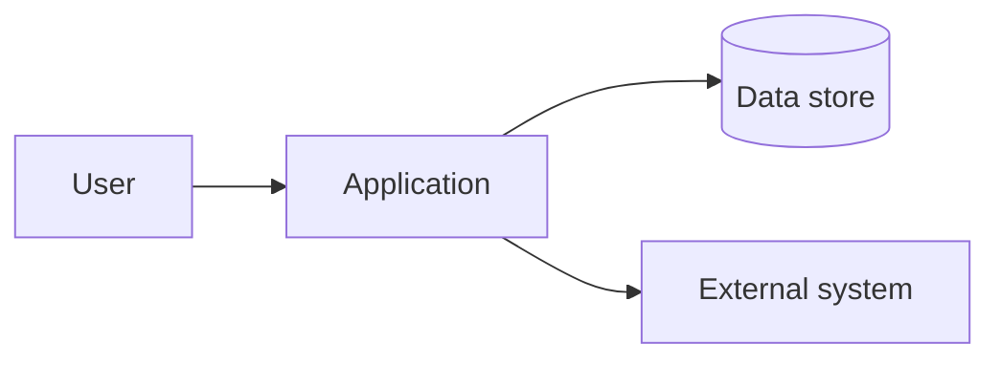

# Architecture Decision — <name>

- **Status:** draft | proposed | accepted | superseded
- **Date:** (fill in)
- **Owner / deciders:** (fill in)
- **Sources:** (links + dates for every current-tech claim below)

> Tag each material statement **K** (Known/sourced), **A** (Assumed — educated
> guess), or **U** (Unknown). No unlabeled guesses.

## 1. Context & problem

What the client needs and why this decision is needed now. Reference
`architecture-intake.md`. Include the as-is system if one exists (see §6).

## 2. Architecturally-significant requirements

The few quality attributes that actually shape the design, with weights (sum to
100). These drive the matrix in §4.

| ASR / quality attribute | Weight | Why it matters | Tag |
| ----------------------- | ------ | -------------- | --- |
| (e.g. time-to-market) | | | |
| (e.g. scalability) | | | |
| (e.g. security/compliance) | | | |
| (e.g. cost to run) | | | |
| (e.g. team fit / hiring) | | | |

## 3. Options considered

Two to three genuinely distinct architectures. At least one from outside the
team's usual stacks (or state why requirements rule it out).

### Option A — (name)
- Shape: (monolith / modular monolith / services / event-driven / serverless …)
- Stack: (languages, frameworks, datastore, hosting)
- Pros / Cons:
- Fit notes:

### Option B — (name)
- …

### Option C — (name, optional)
- …

## 4. Decision matrix

Score each option 1–5 against the weighted ASRs (see `decision-matrix.md`).

| ASR (weight) | Option A | Option B | Option C |
| ------------ | -------- | -------- | -------- |
| (asr 1) | | | |
| (asr 2) | | | |
| **Weighted total** | | | |

## 5. Recommendation

- **Chosen:** (option) — one-line justification traceable to §2.
- **Why over the runner-up:** … and the condition under which the runner-up wins.
- **Key trade-offs accepted:**
- **One-way doors in this choice:** (data model, runtime, primary datastore, lock-in)

## 6. Diagrams

Use `diagrams.md`. Include as-is when the client has an existing IS.

## 7. Risks & caveats

| Risk | Likelihood | Impact | Mitigation |
| ---- | ---------- | ------ | ---------- |
| (fill in) | | | |

## 8. Assumptions register

| Assumption | Basis | Confidence | Impact if wrong | How to confirm |
| ---------- | ----- | ---------- | --------------- | -------------- |
| (fill in) | educated guess | low/med/high | | meeting / doc / spike |

## 9. Open questions

| # | Question | Blocking? | Owner | Needed by |
| - | -------- | --------- | ----- | --------- |
| 1 | (fill in) | yes/no | | |

## 10. Next actions

- Spikes to run first (riskiest unknowns): see `tech-backlog.md`.
- Meetings to request: see `technical-meetings.md`.
