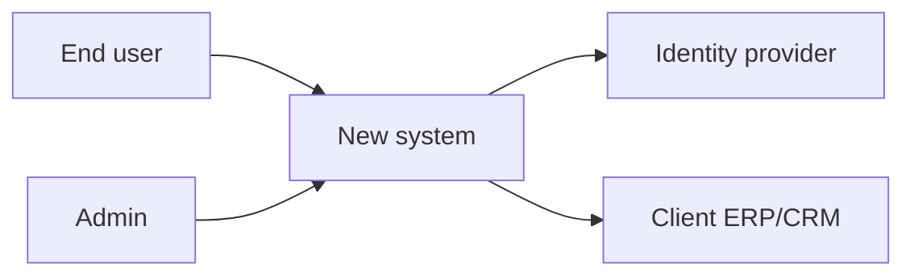
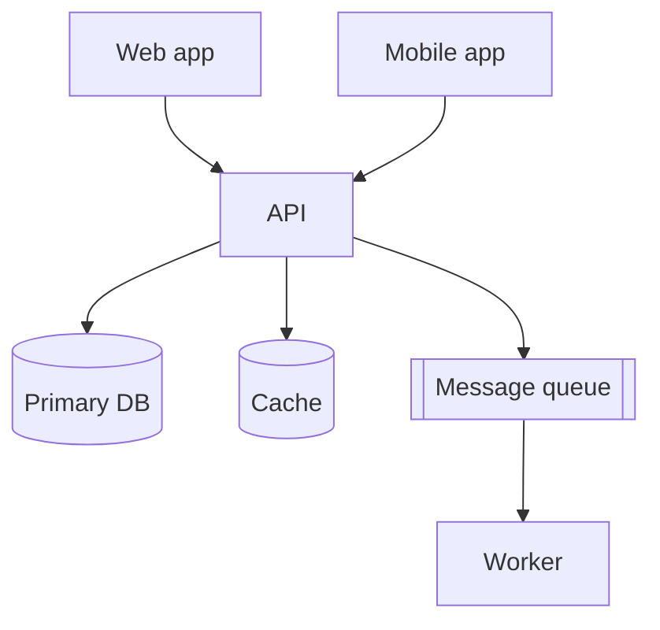
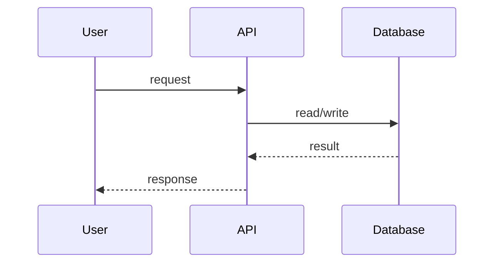
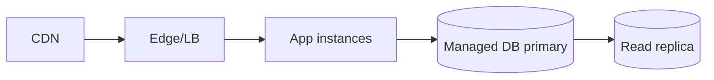
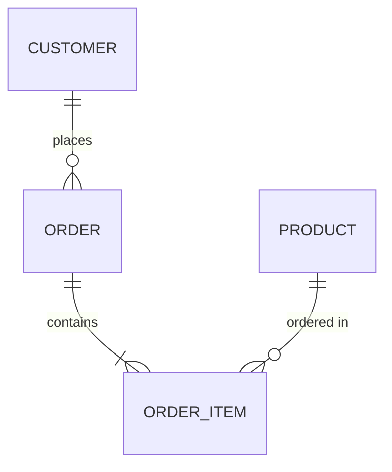

# Diagram Starters — <name>

Mermaid renders in GitHub, most IDEs, and many docs tools. Keep node labels free
of angle brackets. Prefer a few clear views over one dense diagram. Show an
**as-is** view first when the client has an existing system, then the **to-be**.

## System context (who/what touches the system)

## Containers (apps, services, stores)

## Key sequence (a critical flow)

## Deployment (where it runs)

## Data model (when data shape matters)

For formal C4 diagrams, mermaid also supports `C4Context` / `C4Container`; use
them if your renderer does. Otherwise the flowcharts above are portable.
